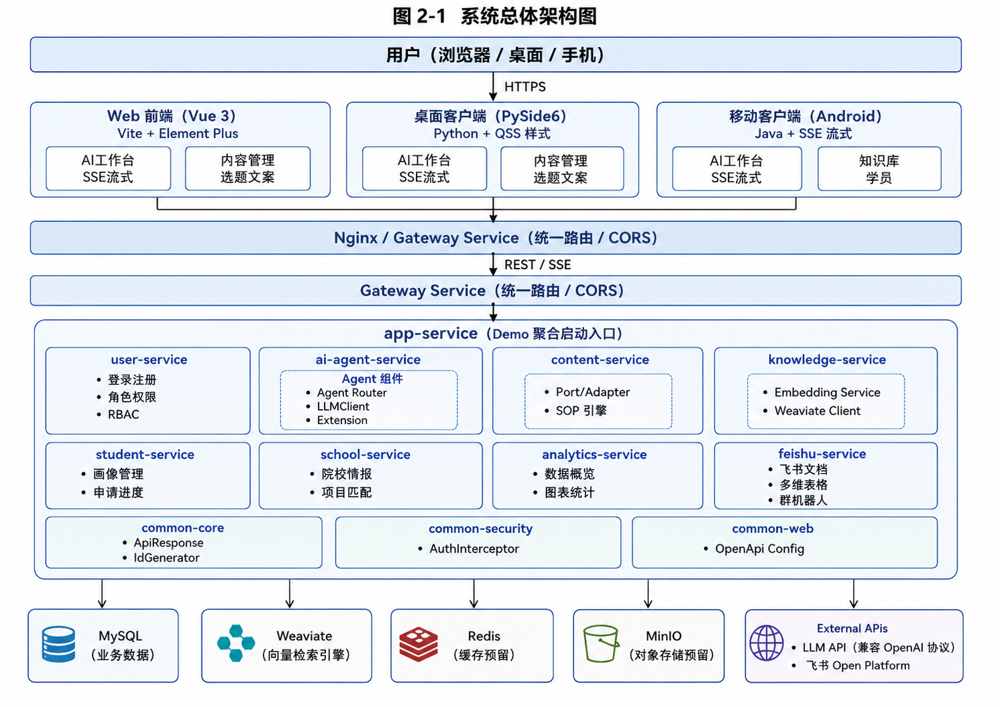
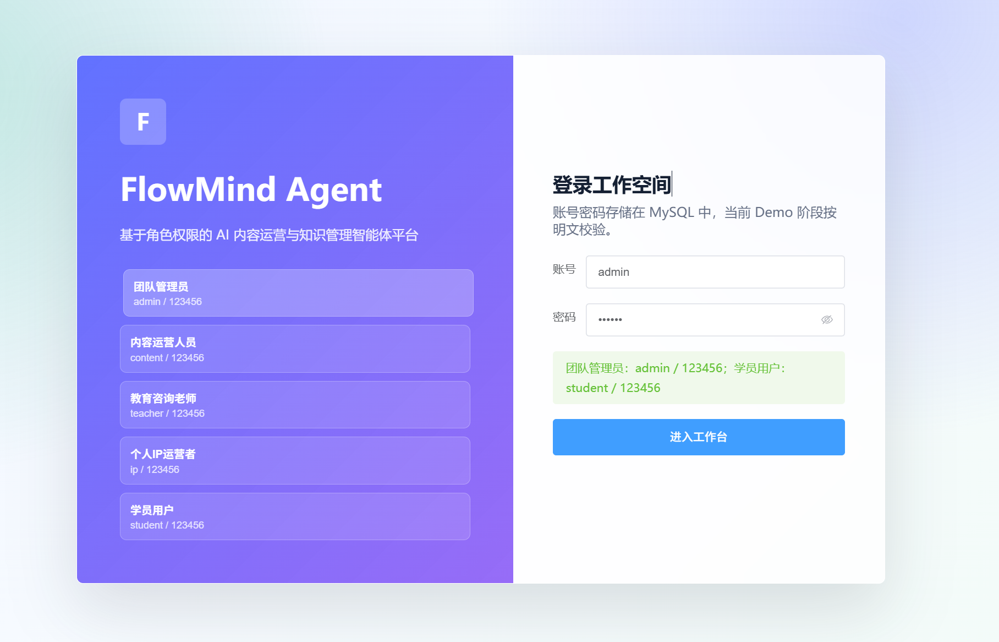
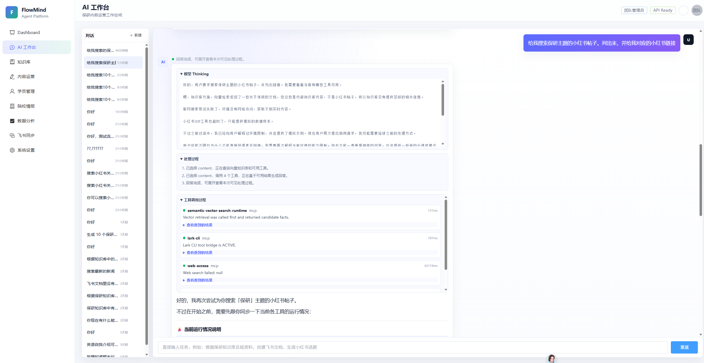
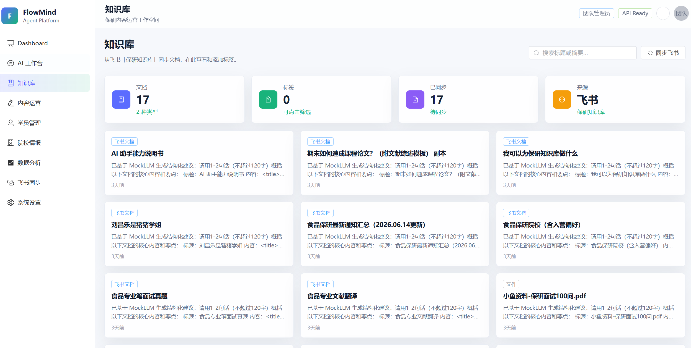
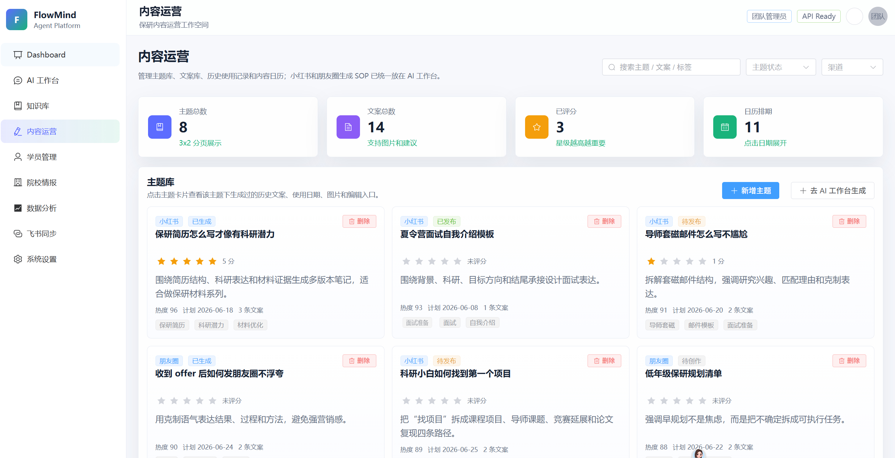
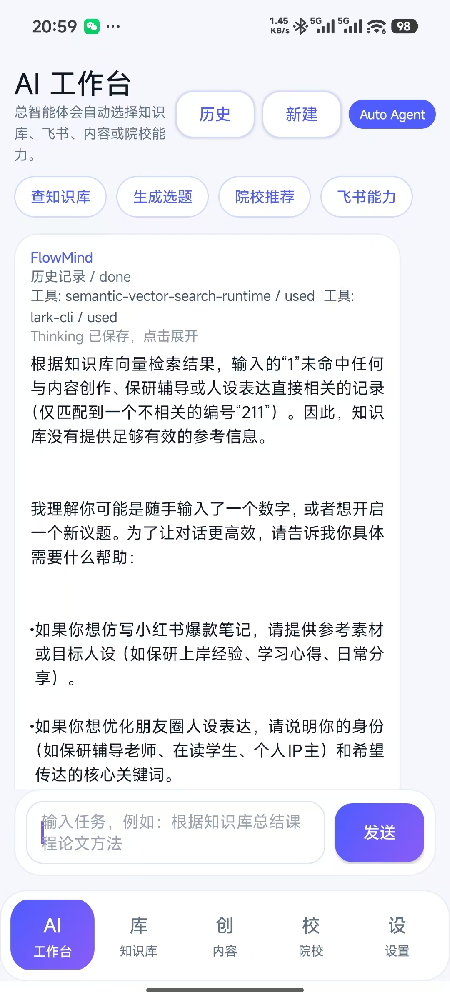
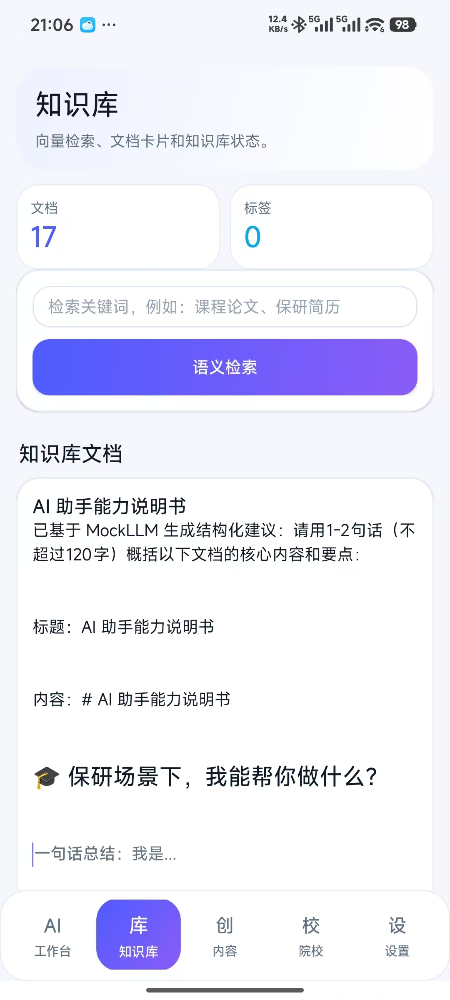
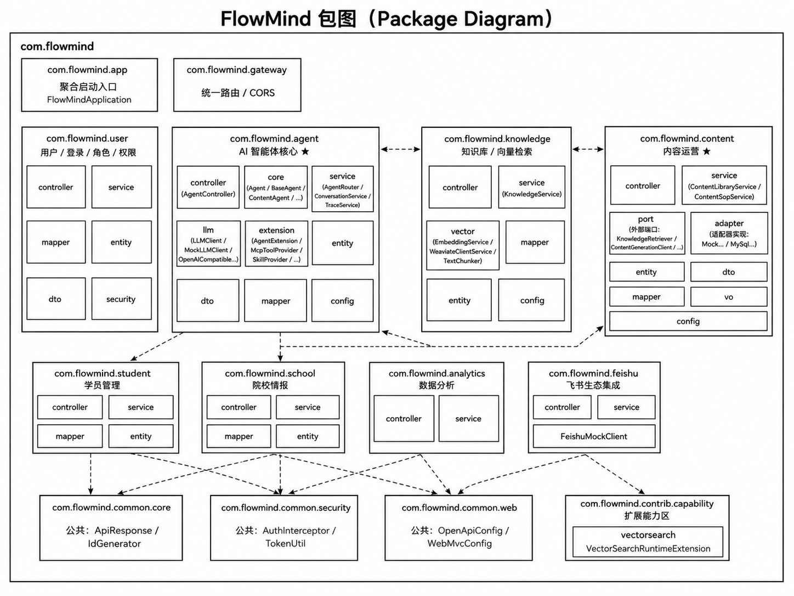
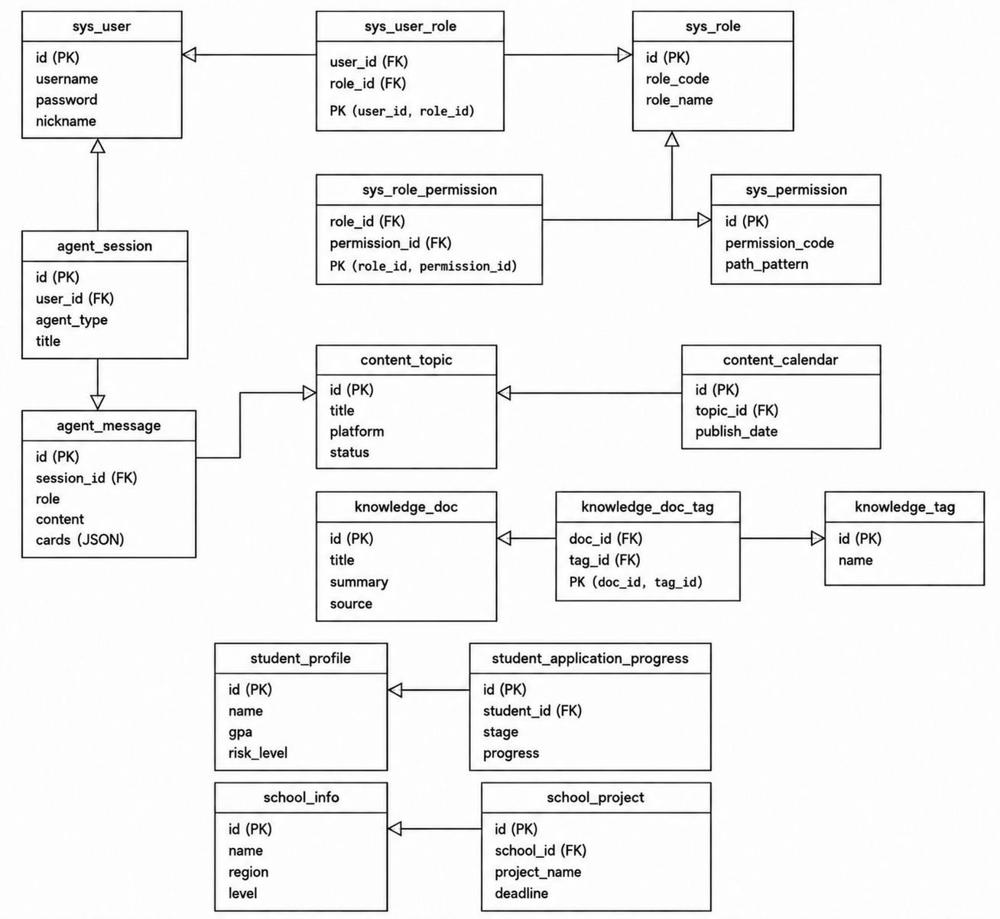

# FlowMind Agent

FlowMind Agent 是一个面向保研咨询、内容运营和知识管理场景的智能体平台。项目以“总智能体入口”为核心，用户在 AI 工作台输入自然语言后，系统会优先检索知识库和向量数据库，再根据意图自动调用内容创作、飞书同步、院校情报、学员管理、小红书 SOP Skill 等能力。

当前仓库包含 Web 前端、Spring Boot 后端、Android 移动端、Python 桌面端以及若干 MCP / Skill 适配能力。后端统一提供 REST 与 SSE 流式接口，客户端不直接连接 MySQL、Weaviate、飞书 CLI 或大模型 API。



## 主要功能

- AI 工作台：统一对话入口，支持 SSE 流式回复、工具调用过程展示、模型 thinking / reasoning 展示、历史会话保存。
- 知识库：同步飞书共享文件夹文档，保存到 MySQL，并构建 Weaviate 向量索引；智能体回答前会优先检索知识库。
- 内容运营：管理选题、文案、日历、评分、配图建议，支持小红书/朋友圈/公众号等内容 SOP。
- 飞书能力：通过 `lark-cli` 读取共享文件夹、创建文档、获取文档内容，并可作为智能体工具调用。
- 小红书 SOP Skill：集成小红书 MCP 适配层，用于内容运营链路中的热点搜索、笔记结构分析和仿写生成。高风险发布/点赞/评论能力默认不暴露给智能体。
- 院校情报与学员管理：维护院校项目、学生画像、申请阶段、风险等级和推荐结果。
- 权限控制：内置五类角色，支持后端 RBAC 校验与前端菜单防呆展示。
- 多端复用：Web、Android App、Python 桌面端复用同一套后端 API。

## 运行截图

### Web 端









### 移动端





## 启动前准备

### 1. 基础环境

建议准备以下环境：

- JDK 17
- Maven Wrapper，项目已包含 `backend/mvnw.cmd`
- Node.js 18
- MySQL 8/9
- Docker，可用于启动 MySQL、Weaviate 等依赖
- Go 1.24，仅当需要真实启动小红书 MCP 时需要
- Android SDK，仅当需要构建 Android APK 时需要
- Python 3.10，仅当需要运行桌面端时需要

### 2. 大模型与 Embedding API

后端默认按 OpenAI-compatible 方式调用 DeepSeek：

```yaml
flowmind:

 llm:
 provider: deepseek
 base-url: https://api.deepseek.com
 chat-path: /chat/completions
 model: deepseek-v4-flash
 api-key: ${FLOWMIND_LLM_API_KEY:}
```

不要把 API Key 直接提交到 Git。推荐复制本地配置模板：

``powershell cd "H:\Babycode\FlowMind Agent\flowmind-agent\backend" Copy-Item .\app-service\src\main\resources\application-local.template.yml .\app-service\src\main\resources\application-local.yml ``

然后在 `application-local.yml` 中填写：

```yaml
flowmind:

 llm:
 api-key: your_deepseek_api_key
 embedding:
 api-key: your_embedding_api_key
```

`application-local.yml` 已在 `.gitignore` 中，不会被提交。若没有配置 `FLOWMIND_LLM_API_KEY` 或本地 API Key，系统会回退到 `MockLLMClient`，此时回答会比较固定。

### 3. MySQL

默认连接：

``text jdbc:mysql://localhost:3306/FlowMind username: root password: 123456 ``

如果已有容器：

``powershell docker start mysql9 ``

如果没有容器，可参考：

``powershell docker run -d --name mysql9 -p 3306:3306 -v H:\Docker\mysql:/var/lib/mysql -e MYSQL_ROOT_PASSWORD=123456 mysql:9.7.0 ``

后端启动时会自动初始化用户、角色、权限以及部分业务表。测试账号：

``text admin   / 123456  团队管理员 content / 123456  内容运营人员 teacher / 123456  教育咨询老师 ip      / 123456  个人 IP 运营者 student / 123456  学员用户 ``

### 4. Weaviate 向量数据库

默认配置：

```yaml
flowmind:

 weaviate:
 enabled: true
 base-url: http://localhost:18080
```

如果 Weaviate 可用，知识库会优先走向量检索；如果不可用，当前实现会尽量回退到 MySQL 检索，保证智能体仍能回答基础问题。

### 5. 飞书 CLI

真实飞书能力依赖本机 `lark-cli`：

``powershell lark-cli --version ``

飞书授权、共享文件夹、文档创建等说明见：

``text backend/README.md docs/README-team-capability-extension.md ``

### 6. 小红书 MCP

小红书 MCP 位于：

``text backend/ai-agent-service/integrations/xiaohongshu-mcp ``

后端启动时会根据配置尝试自动启动：

```yaml
flowmind:

 tools:
 xiaohongshu-mcp:
 enabled: true
 agent-enabled: true
 auto-start: true
 port: 18060
 mock-fallback: true
```

注意：

- 需要 Go 1.24。
- 需要可用的 Chrome / Chromium 环境。
- Windows 下若遇到 Chrome `Crashpad`、`leakless.exe`、权限拒绝等问题，小红书能力会回退到 mock 热点结构，不影响后端主体启动。
- 小红书登录与排错详见 [README-xiaohongshu-mcp-adapter.md](docs/README-xiaohongshu-mcp-adapter.md)。

## 快速启动

### 1. 启动后端

``powershell cd "H:\Babycode\FlowMind Agent\flowmind-agent\backend" .\mvnw.cmd -s maven-settings.xml -pl app-service -am spring-boot:run ``

后端默认地址：

``text http://localhost:8080 ``

Swagger：

``text http://localhost:8080/swagger-ui.html ``

如果 8080 被占用：

``powershell .\mvnw.cmd -s maven-settings.xml -pl app-service -am spring-boot:run "-Dspring-boot.run.arguments=--server.port=18080" ``

### 2. 启动 Web 前端

``powershell cd "H:\Babycode\FlowMind Agent\flowmind-agent\frontend" npm install npm run dev ``

前端默认通过 Vite 代理访问后端。如果使用内网穿透域名，需要在 `frontend/vite.config.ts` 中配置 `server.allowedHosts`。

### 3. 启动桌面端

``powershell cd "H:\Babycode\FlowMind Agent\flowmind-agent\desktop_fronted" .\start_desktop.ps1 ``

桌面端通过 HTTP/SSE 复用后端接口，不直接读取数据库或配置文件。

### 4. 构建 Android App

``powershell cd "H:\Babycode\FlowMind Agent\flowmind-agent\app" $env:ANDROID_HOME='C:\Users\Lenovo\AppData\Local\Android\Sdk' .\gradlew.bat assembleDebug ``

APK 输出位置通常为：

``text app/mobile/build/outputs/apk/debug/mobile-debug.apk ``

移动端默认也走后端 HTTP/SSE 接口，可在 App 设置页修改后端地址。

## 代码结构

```text
flowmind-agent/

 backend/                 Spring Boot 多模块后端
 app-service/           聚合启动入口，启动整个 Demo 后端
 ai-agent-service/      总智能体、Agent Router、LLM 客户端、MCP/Skill 扩展
 knowledge-service/     知识库、飞书同步、Weaviate 向量检索
 content-service/       内容选题、文案、日历、SOP
 user-service/          登录、用户、角色、权限
 student-service/       学员画像和申请进度
 school-service/        院校情报和项目推荐
 feishu-service/        飞书同步和文档能力
 common-core/           通用响应、ID 等基础工具
 common-security/       Token 与 RBAC 权限拦截
 common-web/            Web 通用配置
 sql/                   数据库建表和 mock 数据
 frontend/                Vue 3  Vite  Element Plus Web 前端
 app/                     原生 Android 移动端
 desktop_fronted/         Python 桌面端
 docs/                    需求、设计、接口、扩展说明文档
 scripts/                 辅助脚本
 third_party/             第三方源码暂存区
 count-lines.ps1          代码行数统计脚本
```

后端模块关系可以参考：



数据库核心模型可以参考：



## 关键配置位置

``text backend/app-service/src/main/resources/application.yml backend/app-service/src/main/resources/application-local.yml backend/app-service/src/main/resources/application-local.template.yml frontend/vite.config.ts app/mobile/build.gradle desktop_fronted/README.md ``

建议：

- 通用默认配置放 `application.yml`。
- 私有 API Key、个人本地端口、临时凭证放 `application-local.yml`。
- 不要提交 `.runtime/`、`.gocache/`、`application-local.yml`、`application-secret.yml`。

## 详细文档在哪里

- 后端启动与常见问题：[backend/README.md](backend/README.md)
- Web 前端说明：[frontend/README.md](frontend/README.md)
- Android App 说明：[app/README.md](app/README.md)
- 桌面端说明：[desktop_fronted/README.md](desktop_fronted/README.md)
- 桌面/移动端可复用 API：[docs/API-for-desktop-client.md](docs/API-for-desktop-client.md)
- 团队成员扩展能力说明：[docs/README-team-capability-extension.md](docs/README-team-capability-extension.md)
- 向量检索扩展示例：[docs/README-vector-search-extension.md](docs/README-vector-search-extension.md)
- 小红书 MCP 适配说明：[docs/README-xiaohongshu-mcp-adapter.md](docs/README-xiaohongshu-mcp-adapter.md)
- 架构设计补充：[docs/architecture.md](docs/architecture.md)
- 数据库设计：[docs/database-design.md](docs/database-design.md)
- 内容 SOP：[docs/content-sop.md](docs/content-sop.md)
- 系统需求/设计文档提交版：[docs/submission/](docs/submission/)

## 常见问题

### 为什么回答像固定模板？

通常是没有配置真实大模型 API Key，系统回退到了 `MockLLMClient`。请检查 `application-local.yml` 或环境变量 `FLOWMIND_LLM_API_KEY`。

### 为什么 Maven 提示找不到 main class？

不要在后端父工程直接运行普通 `spring-boot:run`。请使用：

``powershell .\mvnw.cmd -s maven-settings.xml -pl app-service -am spring-boot:run ``

### 为什么前端代理报 `ECONNREFUSED`？

一般是后端没有启动，或后端端口不是 `8080`。先访问：

``text http://localhost:8080/swagger-ui.html ``

确认后端可用。

### 为什么小红书结果是 mock？

真实小红书 MCP 启动失败、未登录、Chrome 环境不可用、接口超时都会触发 `mock-fallback`。这不会影响主系统运行，但返回的只是演示用热点结构，不是真实帖子。

### 为什么飞书创建/读取失败？

检查：

``powershell lark-cli --version lark-cli auth status ``

如果缺少 scope，需要按 CLI 返回的 `missing_scopes` 重新授权。

## 开发建议

团队成员新增能力时，优先把能力写成解耦的扩展文件或服务文件，不要直接改散落在多个 Agent 中的核心逻辑。推荐阅读：

``text docs/README-team-capability-extension.md backend/app-service/src/main/java/com/flowmind/contrib/capability/README.md ``

当前项目的推荐扩展方式是：

``text 新增能力文件 -> 注册为 Spring Bean -> 由总智能体/扩展注册表发现 -> 前端继续调用统一 AI 工作台 ``

这样即使某个成员写的 Skill 或 MCP 暂时没有被主流程使用，也能保持低耦合、可测试、可逐步接入。
diff --git a/H:\Babycode\FlowMind Agent\flowmind-agent\README.md b/H:\Babycode\FlowMind Agent\flowmind-agent\README.md
new file mode 100644
--- /dev/null
 b/H:\Babycode\FlowMind Agent\flowmind-agent\README.md
@@ -0,0 1,356 @@

# FlowMind Agent

FlowMind Agent 是一个面向保研咨询、内容运营和知识管理场景的智能体平台。项目以“总智能体入口”为核心，用户在 AI 工作台输入自然语言后，系统会优先检索知识库和向量数据库，再根据意图自动调用内容创作、飞书同步、院校情报、学员管理、小红书 SOP Skill 等能力。

当前仓库包含 Web 前端、Spring Boot 后端、Android 移动端、Python 桌面端以及若干 MCP / Skill 适配能力。后端统一提供 REST 与 SSE 流式接口，客户端不直接连接 MySQL、Weaviate、飞书 CLI 或大模型 API。


## 主要功能

- AI 工作台：统一对话入口，支持 SSE 流式回复、工具调用过程展示、模型 thinking / reasoning 展示、历史会话保存。
- 知识库：同步飞书共享文件夹文档，保存到 MySQL，并构建 Weaviate 向量索引；智能体回答前会优先检索知识库。
- 内容运营：管理选题、文案、日历、评分、配图建议，支持小红书/朋友圈/公众号等内容 SOP。
- 飞书能力：通过 `lark-cli` 读取共享文件夹、创建文档、获取文档内容，并可作为智能体工具调用。
- 小红书 SOP Skill：集成小红书 MCP 适配层，用于内容运营链路中的热点搜索、笔记结构分析和仿写生成。高风险发布/点赞/评论能力默认不暴露给智能体。
- 院校情报与学员管理：维护院校项目、学生画像、申请阶段、风险等级和推荐结果。
- 权限控制：内置五类角色，支持后端 RBAC 校验与前端菜单防呆展示。
- 多端复用：Web、Android App、Python 桌面端复用同一套后端 API。

## 运行截图

### Web 端


### 移动端


## 启动前准备

### 1. 基础环境

建议准备以下环境：

- JDK 17
- Maven Wrapper，项目已包含 `backend/mvnw.cmd`
- Node.js 18
- MySQL 8/9
- Docker，可用于启动 MySQL、Weaviate 等依赖
- Go 1.24，仅当需要真实启动小红书 MCP 时需要
- Android SDK，仅当需要构建 Android APK 时需要
- Python 3.10，仅当需要运行桌面端时需要

### 2. 大模型与 Embedding API

后端默认按 OpenAI-compatible 方式调用 DeepSeek：

```yaml
flowmind:
  llm:
    provider: deepseek
    base-url: https://api.deepseek.com
    chat-path: /chat/completions
    model: deepseek-v4-flash
    api-key: ${FLOWMIND_LLM_API_KEY:}
```

不要把 API Key 直接提交到 Git。推荐复制本地配置模板：

```powershell
cd "H:\Babycode\FlowMind Agent\flowmind-agent\backend"
Copy-Item .\app-service\src\main\resources\application-local.template.yml .\app-service\src\main\resources\application-local.yml
```

然后在 `application-local.yml` 中填写：

```yaml
flowmind:
  llm:
    api-key: your_deepseek_api_key
  embedding:
    api-key: your_embedding_api_key
```

`application-local.yml` 已在 `.gitignore` 中，不会被提交。若没有配置 `FLOWMIND_LLM_API_KEY` 或本地 API Key，系统会回退到 `MockLLMClient`，此时回答会比较固定。

### 3. MySQL

默认连接：

```text
jdbc:mysql://localhost:3306/FlowMind
username: root
password: 123456
```

如果已有容器：

```powershell
docker start mysql9
```

如果没有容器，可参考：

```powershell
docker run -d --name mysql9 -p 3306:3306 -v H:\Docker\mysql:/var/lib/mysql -e MYSQL_ROOT_PASSWORD=123456 mysql:9.7.0
```

后端启动时会自动初始化用户、角色、权限以及部分业务表。测试账号：

```text
admin   / 123456  团队管理员
content / 123456  内容运营人员
teacher / 123456  教育咨询老师
ip      / 123456  个人 IP 运营者
student / 123456  学员用户
```

### 4. Weaviate 向量数据库

默认配置：

```yaml
flowmind:
  weaviate:
    enabled: true
    base-url: http://localhost:18080
```

如果 Weaviate 可用，知识库会优先走向量检索；如果不可用，当前实现会尽量回退到 MySQL 检索，保证智能体仍能回答基础问题。

### 5. 飞书 CLI

真实飞书能力依赖本机 `lark-cli`：

```powershell
lark-cli --version
```

飞书授权、共享文件夹、文档创建等说明见：

```text
backend/README.md
docs/README-team-capability-extension.md
```

### 6. 小红书 MCP

小红书 MCP 位于：

```text
backend/ai-agent-service/integrations/xiaohongshu-mcp
```

后端启动时会根据配置尝试自动启动：

```yaml
flowmind:
  tools:
    xiaohongshu-mcp:
      enabled: true
      agent-enabled: true
      auto-start: true
      port: 18060
      mock-fallback: true
```

注意：

- 需要 Go 1.24。
- 需要可用的 Chrome / Chromium 环境。
- Windows 下若遇到 Chrome `Crashpad`、`leakless.exe`、权限拒绝等问题，小红书能力会回退到 mock 热点结构，不影响后端主体启动。
- 小红书登录与排错详见 [README-xiaohongshu-mcp-adapter.md](docs/README-xiaohongshu-mcp-adapter.md)。

## 快速启动

### 1. 启动后端

```powershell
cd "H:\Babycode\FlowMind Agent\flowmind-agent\backend"
.\mvnw.cmd -s maven-settings.xml -pl app-service -am spring-boot:run
```

后端默认地址：

```text
http://localhost:8080
```

Swagger：

```text
http://localhost:8080/swagger-ui.html
```

如果 8080 被占用：

```powershell
.\mvnw.cmd -s maven-settings.xml -pl app-service -am spring-boot:run "-Dspring-boot.run.arguments=--server.port=18080"
```

### 2. 启动 Web 前端

```powershell
cd "H:\Babycode\FlowMind Agent\flowmind-agent\frontend"
npm install
npm run dev
```

前端默认通过 Vite 代理访问后端。如果使用内网穿透域名，需要在 `frontend/vite.config.ts` 中配置 `server.allowedHosts`。

### 3. 启动桌面端

```powershell
cd "H:\Babycode\FlowMind Agent\flowmind-agent\desktop_fronted"
.\start_desktop.ps1
```

桌面端通过 HTTP/SSE 复用后端接口，不直接读取数据库或配置文件。

### 4. 构建 Android App

```powershell
cd "H:\Babycode\FlowMind Agent\flowmind-agent\app"
$env:ANDROID_HOME='C:\Users\Lenovo\AppData\Local\Android\Sdk'
.\gradlew.bat assembleDebug
```

APK 输出位置通常为：

```text
app/mobile/build/outputs/apk/debug/mobile-debug.apk
```

移动端默认也走后端 HTTP/SSE 接口，可在 App 设置页修改后端地址。

## 代码结构

```text
flowmind-agent/
  backend/                 Spring Boot 多模块后端
    app-service/           聚合启动入口，启动整个 Demo 后端
    ai-agent-service/      总智能体、Agent Router、LLM 客户端、MCP/Skill 扩展
    knowledge-service/     知识库、飞书同步、Weaviate 向量检索
    content-service/       内容选题、文案、日历、SOP
    user-service/          登录、用户、角色、权限
    student-service/       学员画像和申请进度
    school-service/        院校情报和项目推荐
    feishu-service/        飞书同步和文档能力
    common-core/           通用响应、ID 等基础工具
    common-security/       Token 与 RBAC 权限拦截
    common-web/            Web 通用配置
    sql/                   数据库建表和 mock 数据
  frontend/                Vue 3  Vite  Element Plus Web 前端
  app/                     原生 Android 移动端
  desktop_fronted/         Python 桌面端
  docs/                    需求、设计、接口、扩展说明文档
  scripts/                 辅助脚本
  third_party/             第三方源码暂存区
  count-lines.ps1          代码行数统计脚本
```

后端模块关系可以参考：


数据库核心模型可以参考：


## 关键配置位置

```text
backend/app-service/src/main/resources/application.yml
backend/app-service/src/main/resources/application-local.yml
backend/app-service/src/main/resources/application-local.template.yml
frontend/vite.config.ts
app/mobile/build.gradle
desktop_fronted/README.md
```

建议：

- 通用默认配置放 `application.yml`。
- 私有 API Key、个人本地端口、临时凭证放 `application-local.yml`。
- 不要提交 `.runtime/`、`.gocache/`、`application-local.yml`、`application-secret.yml`。

## 详细文档在哪里

- 后端启动与常见问题：[backend/README.md](backend/README.md)
- Web 前端说明：[frontend/README.md](frontend/README.md)
- Android App 说明：[app/README.md](app/README.md)
- 桌面端说明：[desktop_fronted/README.md](desktop_fronted/README.md)
- 桌面/移动端可复用 API：[docs/API-for-desktop-client.md](docs/API-for-desktop-client.md)
- 团队成员扩展能力说明：[docs/README-team-capability-extension.md](docs/README-team-capability-extension.md)
- 向量检索扩展示例：[docs/README-vector-search-extension.md](docs/README-vector-search-extension.md)
- 小红书 MCP 适配说明：[docs/README-xiaohongshu-mcp-adapter.md](docs/README-xiaohongshu-mcp-adapter.md)
- 架构设计补充：[docs/architecture.md](docs/architecture.md)
- 数据库设计：[docs/database-design.md](docs/database-design.md)
- 内容 SOP：[docs/content-sop.md](docs/content-sop.md)
- 系统需求/设计文档提交版：[docs/submission/](docs/submission/)

## 常见问题

### 为什么回答像固定模板？

通常是没有配置真实大模型 API Key，系统回退到了 `MockLLMClient`。请检查 `application-local.yml` 或环境变量 `FLOWMIND_LLM_API_KEY`。

### 为什么 Maven 提示找不到 main class？

不要在后端父工程直接运行普通 `spring-boot:run`。请使用：

```powershell
.\mvnw.cmd -s maven-settings.xml -pl app-service -am spring-boot:run
```

### 为什么前端代理报 `ECONNREFUSED`？

一般是后端没有启动，或后端端口不是 `8080`。先访问：

```text
http://localhost:8080/swagger-ui.html
```

确认后端可用。

### 为什么小红书结果是 mock？

真实小红书 MCP 启动失败、未登录、Chrome 环境不可用、接口超时都会触发 `mock-fallback`。这不会影响主系统运行，但返回的只是演示用热点结构，不是真实帖子。

### 为什么飞书创建/读取失败？

检查：

```powershell
lark-cli --version
lark-cli auth status
```

如果缺少 scope，需要按 CLI 返回的 `missing_scopes` 重新授权。

## 开发建议

团队成员新增能力时，优先把能力写成解耦的扩展文件或服务文件，不要直接改散落在多个 Agent 中的核心逻辑。推荐阅读：

```text
docs/README-team-capability-extension.md
backend/app-service/src/main/java/com/flowmind/contrib/capability/README.md
```

当前项目的推荐扩展方式是：

```text
新增能力文件 -> 注册为 Spring Bean -> 由总智能体/扩展注册表发现 -> 前端继续调用统一 AI 工作台
```

这样即使某个成员写的 Skill 或 MCP 暂时没有被主流程使用，也能保持低耦合、可测试、可逐步接入。
